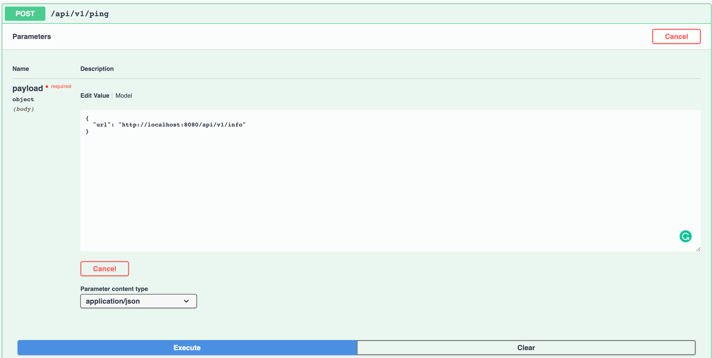
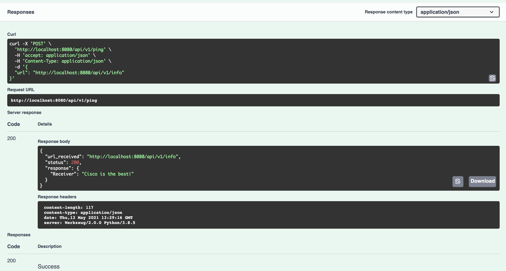
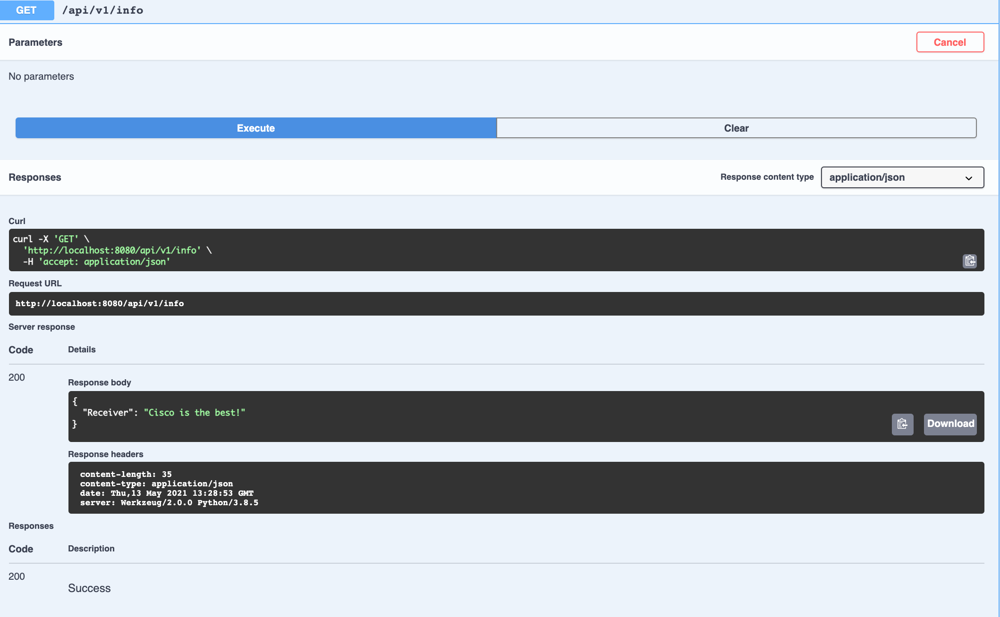
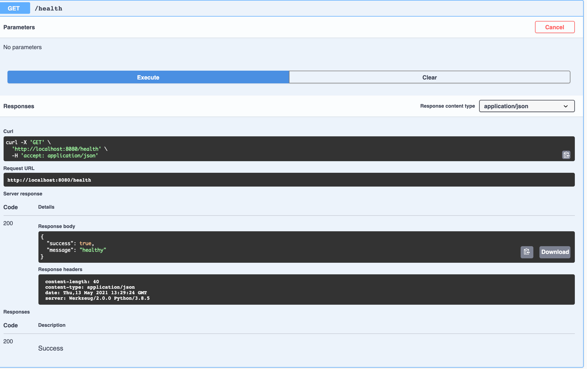

# Docker Ping Service and Health Service
 
 Swagger Documentation have been created with the help of flask microservices 
 ## 1. PingService
  It exposes 2 APIs one for ping request and another for health
  Below are the snaps for Ping Service:-

  

  

 ## 2. ReceiverService
  Receiver Service only exposes hardcode ```/info``` api.

  

 ## 3. Health
  Checks docker health status

  


To run the app:
-git clone repo
-docker-compose up --build
-open the browser and hit the url http://localhost:8080/ and you will see swagger documentation.